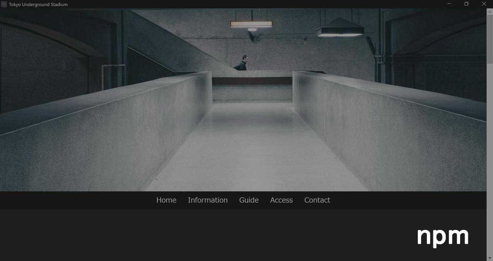

# Tokyo Underground Stadium Demo npm

Tokyo Underground Stadium Demoをnpmで書きかえたサイト

## Description

npmとwebpackで書き換えたヴァージョンです。
sass, jsをそれぞれモジュール化しました。
Web Componentsもfooterで組み込んでいます。
netlifyでのホスティングも試しています。

website: [https://umizoko.github.io/tokyo-underground-stadium-demo-npm/](https://umizoko.github.io/tokyo-underground-stadium-demo-npm/)

netlify: [https://tokyo-underground-stadium-demo-npm.netlify.com/](https://tokyo-underground-stadium-demo-npm.netlify.com/)

## Requirement
- npm5
- webpack4
- jquery3.3.4
- anime.js
- flickity.js

## Note
2018/10/01現在Chrome, Android Chromeでのブラウザでは動作しますが,その他（Firefox、 Edge）ではスタイルが崩れ正常に動作しません。

